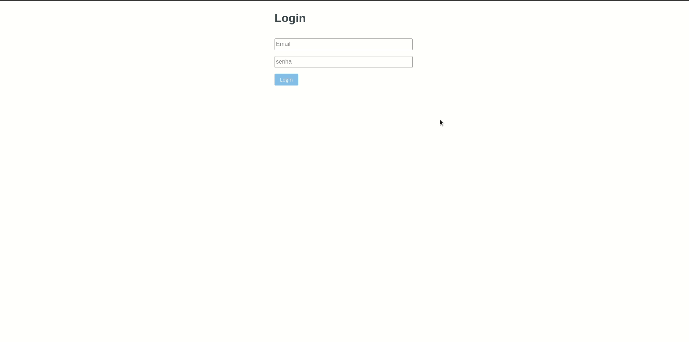
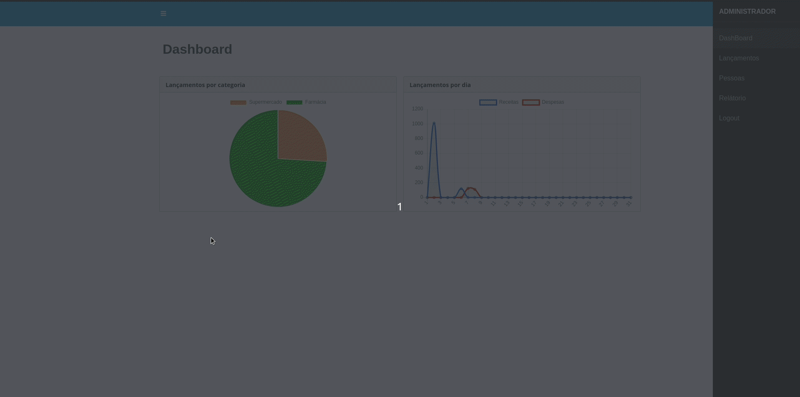
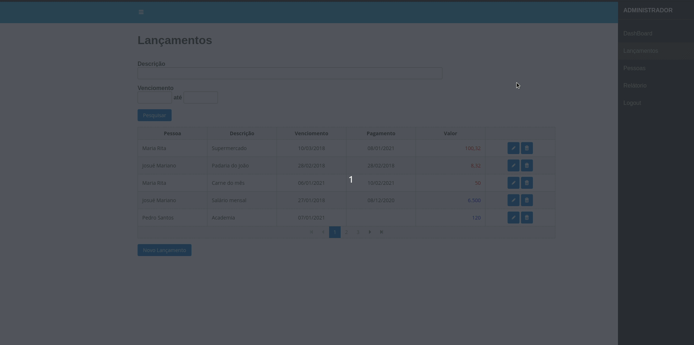
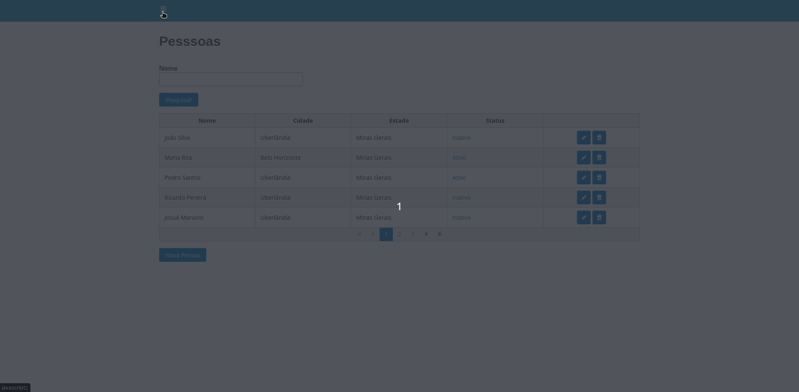

# Algamoney-Ui

## Sobre:
* Projeto realizado no curso da plataforma de ensino [Algaworks](https://www.algaworks.com/), onde foi desenvolvido um sistema de lançamentos.
## Tecnologias Utilizadas:
* Angular+ 
* PrimerNg
* TypeScript
* JavaScript
* Css3
* Html5

## Alguns dos conteúdos abordados:

* Amazon Web Services (AWS)
* OAuth2 JWT 
* DashBoard
* Geração de Relatórios
* Upload de Arquivos
* UI/UX com PrimerNG
* Deploy na plataforma Heroku
* Angular
  - Routes
  - Rxjs
  - Modules
  - LazyLoad
  - Template-driven form
  - Reactive Form
  - Directive
  - HttpCliet 

## Gifs

**Login e Dashboard**

**Listagem e criação/edição de Lançamento**

**Listagem e criação/edição de Pessoa**

**Geração de Relatório de Lançamentos**

